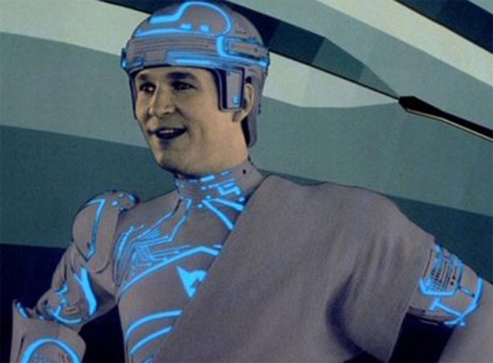
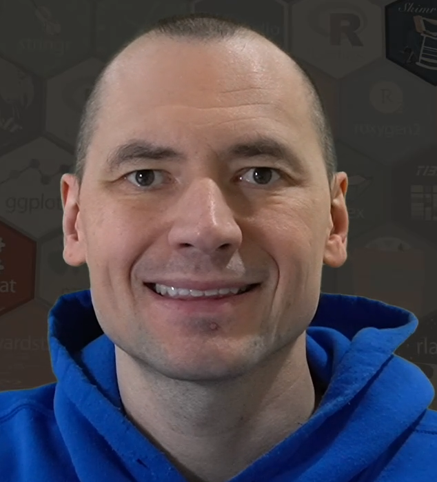
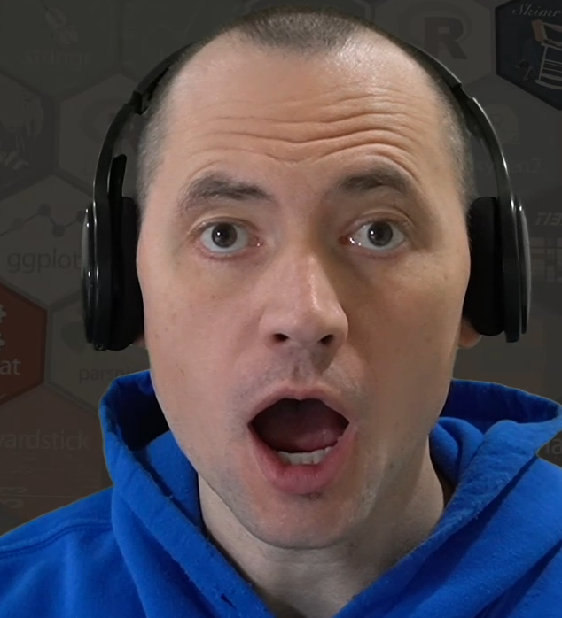
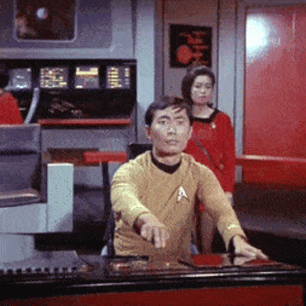
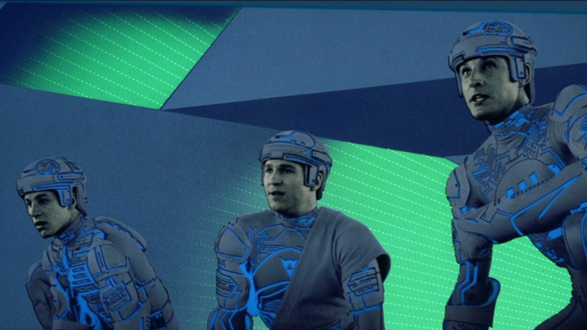

```{r setup, include=FALSE}
options(htmltools.dir.version = FALSE)
knitr::opts_chunk$set(
  fig.width = 10, fig.height = 6, fig.retina = 2, warning = FALSE, message = FALSE
)
library(magrittr)
library(xaringanthemer)
library(fontawesome)
style_mono_dark(
  base_color = "#cbf7ed",
  header_font_google = google_font("Orbitron", "700"),
  text_font_google = google_font("Azeret Mono", "400"),
  base_font_size = "24px",
  code_font_size = "1.8rem"
)
extra_css <- list(
  ".hide-count .remark-slide-number" = list(
      display = "none"
  ),
  ".large" = list(
    "font-size" = "1.5em"
  ),
  ".big" = list(
    "font-size" = "2em"
  ),
  ".large2" = list(
    "font-size" = "1.2em"
  ),
  ".medium" = list(
    "font-size" = "60%"
  ),
  ".third" = list(
    width = "33%"
  ),
  ".two-third" = list(
    width = "66%"
  ),
  ".right-column img" = list(
    "max-height" = "35vh",
    "margin-top" = "-2em"
  ),
  ".large .remark-code" = list( 
    "font-size" = "200% !important"
  ),
  ".tiny .remark-code" = list(
    "font-size" =  "80% !important"
  ),
  ".medium .remark-code" = list(
    "font-size" =  "160% !important"
  ),
  ".remark-slide-number" = list(
    "display" = "none"
  ),
  ".twitter-logo" = list(
    "position" = "absolute",
    "bottom" = "40%",
    "left" = "8%"
  ),
  ".twitter-text" = list(
    "position" = "absolute",
    "bottom" = "35%",
    "left" = "5%"
  ),
  ".github-logo" = list(
    "position" = "absolute",
    "bottom" = "40%",
    "left" = "27%"
  ),
  ".github-text" = list(
    "position" = "absolute",
    "bottom" = "35%",
    "left" = "25%"
  ),
  ".podcast-logo" = list(
    "position" = "absolute",
    "bottom" = "40%",
    "left" = "52%"
  ),
  ".podcast-text" = list(
    "position" = "absolute",
    "bottom" = "35%",
    "left" = "45%"
  ),
  ".sds-logo" = list(
    "position" = "absolute",
    "bottom" = "40%",
    "left" = "80%"
  ),
  ".sds-text" = list(
    "position" = "absolute",
    "bottom" = "35%",
    "left" = "70%"
  ),
  ".twitch-logo" = list(
    "position" = "absolute",
    "bottom" = "10%",
    "left" = "27%"
  ),
  ".twitch-text" = list(
    "position" = "absolute",
    "bottom" = "5%",
    "left" = "18%"
  ),
  ".rweekly-logo" = list(
    "position" = "absolute",
    "bottom" = "10%",
    "left" = "58%"
  ),
  ".rweekly-text" = list(
    "position" = "absolute",
    "bottom" = "5%",
    "left" = "55%"
  )
)

style_extra_css(css = extra_css, outfile = "custom.css")

```

```{r xaringanExtra, echo=FALSE}
#xaringanExtra::use_animate_css()
xaringanExtra::use_xaringan_extra(c("tile_view", "animate_css", "tachyons"))
```

```{r metathis, echo=FALSE}
library(metathis)
meta() %>%
  meta_general(
    description = "A story of how I took down an entire HPC cluster and lived to tell about it.",
    generator = "xaringan and remark.js"
  ) %>%
  meta_name("github-repo" = "rpodcast/hpc_corr_datamishaps") %>%
  meta_social(
    title = "Power-Hungry Correlations at their (HPC) Cores",
    url = "https://rpodcast.github.io/hpc_corr_datamishaps",
    image = "https://rpodcast.github.io/hpc_corr_datamishaps/img/hpc_corr_cover.png",
    image_alt = "The first slide of the Power-Hungry Correlations at their (HPC) Cores presentation in the Data Mishaps 2022 Conference held on February 24, 2022",
    og_type = "website",
    og_author = "Eric Nantz",
    twitter_card_type = "summary_large_image",
    twitter_creator = "@theRcast"
  )
```


class: left, middle, hide-count
background-image: url(img/tron_legacy_wallpaper_dim.png) 
background-size: 100%

<div class="talk-logo event-logo"></div>

.talk-meta[
.talk-title[
# Power-Hungry Correlations at their (HPC) Cores
]
]

.talk-author[
Eric Nantz
]

.talk-event[
Data Mishaps Night
]

.talk-date[
February 24th, 2022
]

.talk-link[
Slides available at [bit.ly/hpcmishap](https://bit.ly/hpcmishap)
]

```{css echo=FALSE}
.talk-meta {
  position: absolute;
  text-align: left;
  bottom: 400px;
  left: 25px;
}

.talk-author {
  font-weight: bold;
  font-size: 2.0em;
  line-height: 1em;
}

.talk-event {
  font-weight: bold;
  font-size: 1.5em;
  line-height: 1em;
}

.talk-date {
  font-size: 1.25em;
  line-height: 0;
}

.talk-link {
  font-size: 1.25em;
  position: absolute;
  bottom: 5%;
  left: 4%;
}

.talk-logo {
  width: 320px;
  height: 320px;
  position: absolute;
  top: 50%;
  left: 70%;
}

.event-logo {
  background-image: url('img/datamishaps_hexsticker.png');
  background-size: cover;
  background-repeat: no-repeat;
}

.koopa-img {
  background-image: url('img/koopa.png');
  background-size: cover;
  background-repeat: no-repeat;
}

.koopa-logo {
  width: 150px;
  height: 200px;
  position: absolute;
  top: 38%;
  left: 65%;
}
```


---
background-image: url(img/network_background_mod.png) 
background-size: cover

## The Journey Begins

.pull-left[
.big[
Early days of my career in life sciences

Ready to contribute!
]

]

.pull-right[

]


---
background-image: url(img/network_background_mod.png) 
background-size: cover

# A New Challenge Awaits


.big[
* Thousands of genetic biomarkers
* Explore possible associations with multiple clinical outcomes
* Analyze BIG DATA with `r fa("r-project")`!
]

---
class: inverse, middle
background-image: url(img/network_background_mod.png) 
background-size: cover
exclude: true

.f6.code[
```r
for (x in biomarker_var) {
  for (y in response_var) {
    cor(x, y)
  }
}
```
]

---
class: inverse, middle
background-image: url(img/network_background_mod.png) 
background-size: cover
exclude: true

.f6.code[
```r
for (x in biomarker_var) {
  for (y in response_var) {
    # permuted data sets
    lapply(
      1:1000, 
      custom_cor, 
      x = x, 
      y = y)
  }
}
```
]

---
class: inverse, middle
background-image: url(img/network_background_mod.png) 
background-size: cover

<div class="koopa-logo koopa-img"></div>

.f6.code[
```r
for (x in biomarker_var) {
  for (y in response_var) {
    # permuted data sets
    mclapply(
      1:1000, 
      custom_cor, 
      x = x, 
      y = y,
      mc.cores = detectCores())
  }
}
```
]

---
class: middle
background-image: url(img/hpc-cluster.jpg) 
background-size: cover

### Batches to the Grid

```bash
#!/bin/bash
Rscript script.R --batch1
Rscript script.R --batch2
Rscript script.R --batch3
Rscript script.R --batch4
Rscript script.R --batch5
Rscript script.R --batch6
...
Rscript script.R --batch1000
```

---
class: inverse hide-count animated fadeIn

--

<ul class="nobull">
<li>
<div class="container">
  
  <p>Hello Eric, this is Ed from the research IT team. Did you submit a job array with ID 8675309?</p>
</div>
</li>

--

<li>
<div class="container darker">
  
  <p>Hello Ed, nice to meet you! Yes, I submitted that job earlier today. I guess it is taking longer than I anticipated to complete.</p>
</div>
</li>

--

<li>
<div class="container">
  
  <p>Your HPC jobs have brought the entire HPC cluster down.</p>
</div>
</li>

--

<li>
<div class="container darker">
  
  <p>Oh no!</p>
</div>
</li>
</ul>

---
background-image: url(img/network_background_mod.png)
background-size: cover

## Small Glitch ...

.pull-left[
.large[
* Compute servers running my jobs had memory and CPU usage **maxed out**
* All other jobs were stopped, even the really important ones
* Emergency server reboot was required
]
]

.pull-right[

]

---
background-image: url(img/network_background_mod.png) 
background-size: cover

## New Chapter Begins

.pull-left[
.large2[
* After correcting the mistake, eager to learn better approaches to HPC computing
* Launched my most valuable relationships in the company
* Kickstarted amazing innovations in our statistical computing infrastructure
]
]

.pull-right[

]

---
background-image: url(img/network_background_mod.png) 
background-size: cover

# Thank you!

.twitter-logo[
## `r fa("twitter", fill = "steelblue", height = "2em")`
]
.twitter-text[
.large2[
[@theRcast](https://twitter.com/thercast)
]
]

.github-logo[
## `r fa("github", fill = "steelblue", height = "2em")`
]

.github-text[
.large2[
[@rpodcast](https://github.com/rpodcast)
]
]

.podcast-logo[
## `r fa("microphone", fill = "steelblue", height = "2em")`
]

.podcast-text[
.large2[
[r-podcast.org](https://r-podcast.org)
]
]

.sds-logo[
## `r fa("youtube", fill = "steelblue", height = "2em")`
]

.sds-text[
.large2[
[shinydevseries.com](https://shinydevseries.com)
]
]

.twitch-logo[
## `r fa("twitch", fill = "steelblue", height = "2em")`
]

.twitch-text[
.large2[
[twitch.tv/rpodcast](https://twitch.tv/rpodcast)
]
]

.rweekly-logo[
## `r fa("newspaper", fill = "steelblue", height = "2em")`
]

.rweekly-text[
.large2[
[rweekly.org](https://rweekly.org)
]
]