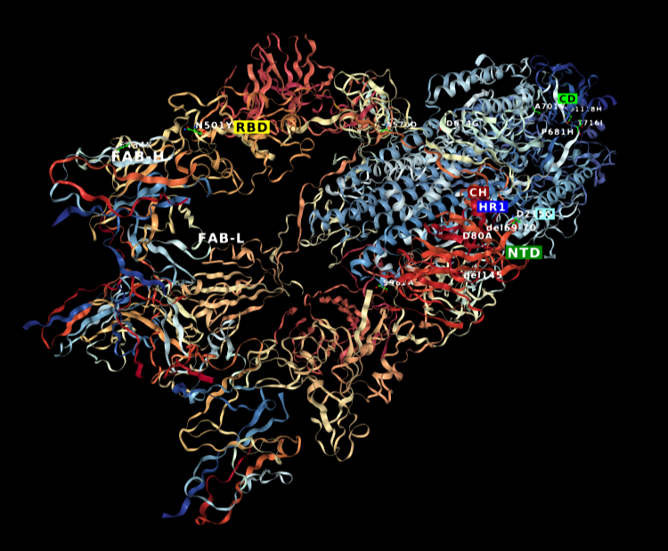

```{r setup, include=FALSE}
options(htmltools.dir.version = FALSE)
knitr::opts_chunk$set(
  fig.width = 10, fig.height = 6, fig.retina = 2, warning = FALSE, message = FALSE
)
library(magrittr)
```

```{r xaringan-animate-css, echo=FALSE}
xaringanExtra::use_animate_css()
```

```{r metathis, echo=FALSE}
library(metathis)
meta() %>%
  meta_general(
    description = "A story of how I took down an entire HPC cluster and lived to tell about it.",
    generator = "xaringan and remark.js"
  ) %>%
  meta_name("github-repo" = "rpodcast/hpc_corr_datamishaps") %>%
  meta_social(
    title = "Power-Hungry Correlations at their (HPC) Cores",
    url = "https://rpodcast.github.io/hpc_corr_datamishaps",
    image = "https://rpodcast.github.io/hpc_corr_datamishaps/img/hpc_corr_cover.png",
    image_alt = "The first slide of the Power-Hungry Correlations at their (HPC) Cores presentation in the Data Mishaps 2022 Conference held on February 24, 2022",
    og_type = "website",
    og_author = "Eric Nantz",
    twitter_card_type = "summary_large_image",
    twitter_creator = "@theRcast"
  )
```


class: left, middle, hide-count
background-image: url(img/mcp_explode.png) 
background-size: 100%

<div class="talk-logo event-logo"></div>

.talk-meta[
.talk-title[
# Power-Hungry Correlations at their (HPC) Cores
]
]

.talk-author[
Eric Nantz
]

.talk-event[
Data Mishaps Night
]

.talk-date[
February 24th, 2022
]

```{css echo=FALSE}
.talk-meta {
  position: absolute;
  text-align: left;
  bottom: 400px;
  left: 25px;
}

.talk-author {
  font-weight: bold;
  font-size: 2.0em;
  line-height: 1em;
}

.talk-event {
  font-weight: bold;
  font-size: 1.5em;
  line-height: 1em;
}

.talk-date {
  font-size: 1.25em;
  line-height: 0;
}

.talk-logo {
  width: 160px;
  height: 160px;
  position: absolute;
  top: 66%;
  left: 87%;
}

.event-logo {
  background-image: url('img/datamishaps_hexsticker.png');
  background-size: cover;
  background-repeat: no-repeat;
}
```


---
background-image: url(img/network_background.png) 
background-size: cover

## To the Grid 

.pull-left[

Early days of my career in life sciences

Ready to contribute!
]

.pull-right[

]


---
background-image: url(img/network_background.png) 
background-size: cover

# A New Challenge Awaits

.pull-left[
.big[
* Thousands of genetic biomarkers
* Explore possible associations with multiple clinical outcomes
* My first chance to analyze BIG DATA

]
]

.pull-right[

]
---

# Hello Ninja

<div class="tenor-gif-embed" data-postid="18131061" data-share-method="host" data-aspect-ratio="1" data-width="100%"><a href="https://tenor.com/view/star-trek-star-trek-tos-sulu-explode-computer-gif-18131061">Star Trek Star Trek Tos GIF</a>from <a href="https://tenor.com/search/star+trek-gifs">Star Trek GIFs</a></div> <script type="text/javascript" async src="https://tenor.com/embed.js"></script>

---

As a presentation ninja, you certainly should not be satisfied by the "Hello World" example. You need to understand more about two things:

1. The [remark.js](https://remarkjs.com) library;

1. The **xaringan** package;

Basically **xaringan** injected the chakra of R Markdown (minus Pandoc) into **remark.js**. The slides are rendered by remark.js in the web browser, and the Markdown source needed by remark.js is generated from R Markdown (**knitr**).

---

# remark.js

You can see an introduction of remark.js from [its homepage](https://remarkjs.com). You should read the [remark.js Wiki](https://github.com/gnab/remark/wiki) at least once to know how to

- create a new slide (Markdown syntax<sup>*</sup> and slide properties);

- format a slide (e.g. text alignment);

- configure the slideshow;

- and use the presentation (keyboard shortcuts).

It is important to be familiar with remark.js before you can understand the options in **xaringan**.

.footnote[[*] It is different with Pandoc's Markdown! It is limited but should be enough for presentation purposes. Come on... You do not need a slide for the Table of Contents! Well, the Markdown support in remark.js [may be improved](https://github.com/gnab/remark/issues/142) in the future.]

---
background-image: url(`r xaringan:::karl`)
background-size: cover
class: center, bottom, inverse

# I was so happy to have discovered remark.js!

---

```{r chat-print, echo=FALSE, results="asis"}
chat_slides <- dir("img", pattern = "^chat_", full.names = TRUE)

chat_slides_txt <- glue::glue("

class: hide-count animated fadeIn
background-image: url('{chat_slides}')
background-size: contain
---
")


cat(chat_slides_txt, sep = "")
```

```{r xaringan-themer, include=FALSE, warning=FALSE}
library(xaringanthemer)
style_mono_dark(
  base_color = "#cbf7ed",
  header_font_google = google_font("Orbitron", "700"),
  text_font_google = google_font("Azeret Mono", "400"),
  base_font_size = "24px",
  extra_css = list(
    ".hide-count .remark-slide-number" = list(
        display = "none"
    )
  )
)
```
